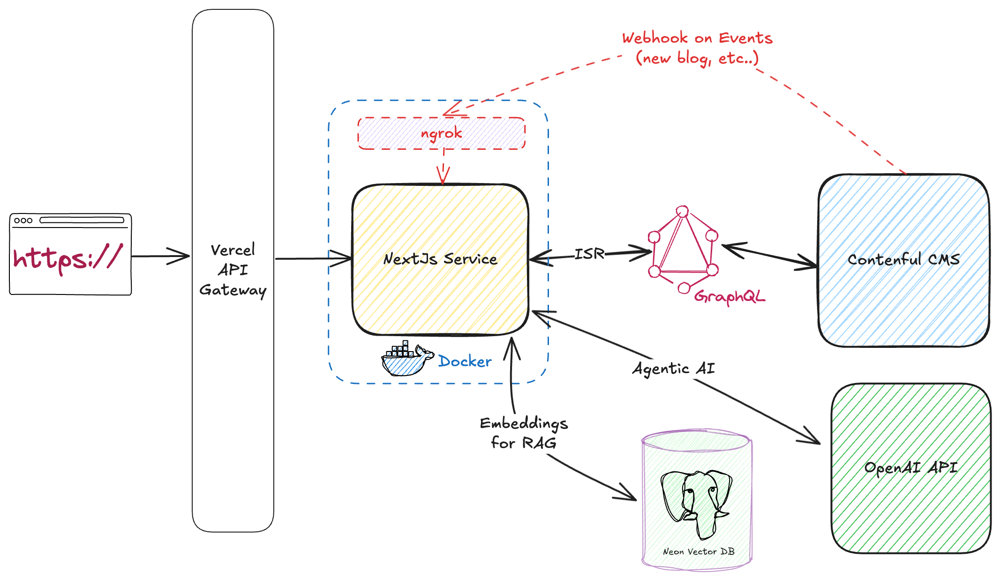

# AKQA Hub - Technical Documentation

## Table of Contents

1. [Overview](#overview)
2. [What is a CMS and Headless CMS?](#what-is-a-cms-and-headless-cms)
3. [Architecture Overview](#architecture-overview)
4. [Technology Stack](#technology-stack)
5. [Project Structure](#project-structure)
6. [How Data Flows Through The Application](#how-data-flows-through-the-application)
7. [Internationalization (i18n)](#internationalization-i18n)
8. [Content Management with Contentful](#content-management-with-contentful)
9. [GraphQL Integration](#graphql-integration)
10. [Routing System](#routing-system)
11. [Preview & Draft Mode](#preview--draft-mode)
12. [Key Components Explained](#key-components-explained)
13. [Docker Integration](#docker-integration)
14. [Build & Deployment Process](#build--deployment-process)

---

## Overview

AKQA Hub is a modern, multilingual blog application built with **Next.js 15** that fetches content from **Contentful**, a headless CMS platform. The application supports two languages (English and German) and implements server-side rendering, static site generation, and live preview features for content editors.

---

## What is a CMS and Headless CMS?

### Traditional CMS

A **Content Management System (CMS)** is software that helps you create, manage, and publish digital content without needing to write code. Traditional CMS platforms (like WordPress) combine:

- **Content storage** (where your blog posts, images, etc. are saved)
- **Content presentation** (the website visitors see)

### Headless CMS

A **Headless CMS** (like Contentful) separates these concerns:

- The CMS only handles **content storage and management** (the "backend")
- Your application (this Next.js app) handles **content presentation** (the "frontend")

**Benefits:**

- Freedom to build the frontend with any technology (React, Vue, mobile apps, etc.)
- Same content can be displayed on multiple platforms (website, mobile app, smartwatch)
- Better performance and security
- Content editors use Contentful's interface, developers use modern frameworks

---

## Architecture Overview



---

## Technology Stack

### Core Technologies

- **Next.js 15.5.4** - React framework for server-side rendering and static site generation
- **React 19.2.0** - UI library for building components
- **TypeScript 5.9.3** - Type-safe JavaScript

### Content Management

- **Contentful** - Headless CMS for content storage
- **GraphQL** - Query language for fetching data from Contentful
- **graphql-request** - Lightweight GraphQL client
- **@graphql-codegen** - Generates TypeScript types from GraphQL schema

### Internationalization

- **next-i18n-router** - Handles URL routing for different languages
- **react-i18next** - Translation library
- **i18next** - Internationalization framework

### Styling

- **Tailwind CSS 4.1.14** - Utility-first CSS framework
- **PostCSS** - CSS processing

### Live Preview

- **@contentful/live-preview** - Real-time content preview for editors
- **@contentful/rich-text-react-renderer** - Renders rich text content

---

## Project Structure

```
akqa-hub/
├── src/
│   ├── app/                          # Next.js App Router
│   │   ├── layout.tsx               # Root layout (minimal wrapper)
│   │   ├── globals.css              # Global styles
│   │   ├── sitemap.ts               # Generates XML sitemap
│   │   ├── manifest.webmanifest     # PWA manifest
│   │   ├── [locale]/                # Dynamic locale routes (en-US, de-DE)
│   │   │   ├── page.tsx             # Homepage for each language
│   │   │   ├── layout.tsx           # Layout wrapper with header/footer
│   │   │   ├── not-found.tsx        # 404 page for locale
│   │   │   ├── [slug]/              # Dynamic blog post pages
│   │   │   │   └── page.tsx         # Individual blog post page
│   │   │   └── [...notFound]/       # Catch-all 404 handler
│   │   └── api/
│   │       └── enable-draft/        # API endpoint for preview mode
│   │           └── route.ts
│   │
│   ├── components/                   # React components
│   │   ├── features/
│   │   │   ├── article/             # Blog post components
│   │   │   │   ├── ArticleHero.tsx  # Hero section with image
│   │   │   │   ├── ArticleContent.tsx # Post content renderer
│   │   │   │   ├── ArticleTile.tsx  # Post card preview
│   │   │   │   └── ArticleTileGrid.tsx # Grid of post cards
│   │   │   │
│   │   │   ├── contentful/          # Contentful-specific components
│   │   │   │   ├── CtfImage.tsx     # Optimized image component
│   │   │   │   ├── CtfRichText.tsx  # Rich text renderer
│   │   │   │   └── CtfPreviewProvider.tsx # Live preview wrapper
│   │   │   │
│   │   │   └── language-selector/   # Language switcher
│   │   │       ├── LanguageSelector.tsx
│   │   │       ├── LanguageSelectorDesktop.tsx
│   │   │       └── LanguageSelectorMobile.tsx
│   │   │
│   │   ├── shared/                  # Reusable components
│   │   │   ├── container/           # Layout container
│   │   │   ├── format-date/         # Date formatter
│   │   │   ├── portal/              # Portal component for modals
│   │   │   └── i18n/                # Translation provider
│   │   │
│   │   └── templates/               # Page templates
│   │       ├── header/              # Site header
│   │       └── footer/              # Site footer
│   │
│   ├── i18n/                        # Internationalization config
│   │   ├── config.ts               # Locale settings
│   │   └── index.ts                # i18n initialization
│   │
│   ├── lib/                         # Core libraries
│   │   ├── client.ts               # Contentful GraphQL client
│   │   ├── __generated/            # Auto-generated TypeScript types
│   │   │   ├── sdk.ts              # GraphQL SDK with type-safe methods
│   │   │   ├── graphql.schema.graphql # GraphQL schema
│   │   │   └── graphql.schema.json
│   │   │
│   │   └── graphql/                # GraphQL queries
│   │       ├── pageBlogPost.graphql # Blog post queries
│   │       ├── pageLanding.graphql  # Landing page queries
│   │       ├── authorFields.graphql # Author data fragments
│   │       └── imageFields.graphql  # Image data fragments
│   │
│   └── middleware.ts               # Request interceptor for routing
│
├── public/
│   ├── locales/                    # Translation files
│   │   ├── en-US/
│   │   │   └── common.json        # English translations
│   │   └── de-DE/
│   │       └── common.json        # German translations
│   │
│   └── assets/                     # Static assets
│
├── config/                         # Configuration files
│   ├── headers.js                 # Security headers
│   └── plugins.js                 # Next.js plugins
│
├── types/                          # TypeScript type declarations
│   └── declaration.d.ts           # Global type definitions
│
├── bin/                            # Shell scripts
│   └── setup.sh                   # Project setup script
│
├── .dockerignore                  # Docker ignore patterns
├── Dockerfile                     # Docker container configuration
├── docker-compose.yml             # Docker Compose orchestration
├── codegen.ts                     # GraphQL code generation config
├── next.config.js                 # Next.js configuration
├── package.json                   # Dependencies
├── tsconfig.json                  # TypeScript configuration
└── vercel.json                    # Vercel deployment config
```

---

## How Data Flows Through The Application

### Step-by-Step Request Flow

Let's walk through what happens when a user visits `https://blog.example.com/de-DE/my-first-post`:

#### 1. **Request Arrives**

```
User types URL → Request hits Next.js server
URL: /de-DE/my-first-post
```

#### 2. **Middleware Processing** (`src/middleware.ts`)

```typescript
// Middleware intercepts the request
export function middleware(request: NextRequest) {
  return i18nRouter(request, i18nConfig);
}
```

- Checks if URL has a valid locale (`de-DE`)
- If no locale, redirects to default locale (`en-US`)
- Passes request to appropriate route handler

#### 3. **Route Matching**

```
Next.js matches URL pattern: /[locale]/[slug]
Extracts: locale = "de-DE", slug = "my-first-post"
Loads: src/app/[locale]/[slug]/page.tsx
```

#### 4. **Data Fetching** (`src/app/[locale]/[slug]/page.tsx`)

```typescript
export default async function Page({ params }: BlogPageProps) {
  const { locale, slug } = await params;
  const { isEnabled: preview } = await draftMode();

  // Choose correct client (preview or production)
  const gqlClient = preview ? previewClient : client;

  // Fetch blog post data from Contentful
  const { pageBlogPostCollection } = await gqlClient.pageBlogPost({
    locale,
    slug,
    preview,
  });

  const blogPost = pageBlogPostCollection?.items[0];
  // ... render component
}
```

#### 5. **GraphQL Query to Contentful** (`src/lib/client.ts`)

```typescript
// Client sends query to Contentful's GraphQL API
const graphQlClient = new GraphQLClient(endpoint, {
  headers: {
    Authorization: `Bearer ${process.env.CONTENTFUL_ACCESS_TOKEN}`,
  },
});
```

The query sent to Contentful:

```graphql
query pageBlogPost($locale: String, $slug: String, $preview: Boolean) {
  pageBlogPostCollection(where: { slug: $slug }, locale: $locale, preview: $preview, limit: 1) {
    items {
      title
      slug
      author {
        name
        avatar {
          url
        }
      }
      publishedDate
      content {
        json
        links
      }
      featuredImage {
        url
        width
        height
      }
      # ... more fields
    }
  }
}
```

#### 6. **Contentful Response**

Contentful returns JSON data:

```json
{
  "data": {
    "pageBlogPostCollection": {
      "items": [{
        "title": "Mein erster Beitrag",
        "slug": "my-first-post",
        "author": {
          "name": "John Doe",
          "avatar": { "url": "https://images.ctfassets.net/..." }
        },
        "publishedDate": "2024-01-15",
        "content": { "json": {...}, "links": {...} },
        "featuredImage": {
          "url": "https://images.ctfassets.net/...",
          "width": 1200,
          "height": 800
        }
      }]
    }
  }
}
```

#### 7. **Translation Loading** (`src/i18n/index.ts`)

```typescript
// Load German translations
const { t, resources } = await initTranslations({ locale: 'de-DE' });

// Translations loaded from public/locales/de-DE/common.json
t('article.relatedArticles'); // Returns: "Verwandte Artikel"
```

#### 8. **Component Rendering**

The page component renders:

```tsx
<TranslationsProvider locale="de-DE" resources={resources}>
  <Container>
    <ArticleHero article={blogPost} />
  </Container>
  <Container>
    <ArticleContent article={blogPost} />
  </Container>
</TranslationsProvider>
```

#### 9. **HTML Generation**

Next.js generates the final HTML with:

- Blog post content from Contentful
- Images optimized via Next.js Image component
- Translations in German
- SEO metadata

#### 10. **Response Sent**

```
HTML sent to user's browser → Page displays
```

---

## Internationalization (i18n)

The application supports two locales defined in `src/i18n/config.ts`:

```typescript
export const locales = ['en-US', 'de-DE'];
export const defaultLocale: Locale = 'en-US';
```

### How Languages Work

#### URL Structure

- English (default): `https://blog.com/` or `https://blog.com/en-US/`
- German: `https://blog.com/de-DE/`

#### Translation Files

Translations are stored in JSON files:

**`public/locales/en-US/common.json`**:

```json
{
  "article": {
    "relatedArticles": "Related articles",
    "featured": "featured"
  },
  "landingPage": {
    "latestArticles": "Latest articles"
  }
}
```

**`public/locales/de-DE/common.json`**:

```json
{
  "article": {
    "relatedArticles": "Verwandte Artikel",
    "featured": "Hervorgehoben"
  },
  "landingPage": {
    "latestArticles": "Neueste Artikel"
  }
}
```

#### Using Translations in Components

```tsx
import { useTranslation } from 'react-i18next';

export const Header = () => {
  const { t } = useTranslation();

  return <h2>{t('landingPage.latestArticles')}</h2>;
  // Displays: "Latest articles" (en-US) or "Neueste Artikel" (de-DE)
};
```

#### Language Selector Component

Users can switch languages via `LanguageSelector` component in the header:

- Detects current locale from URL
- Generates links to same page in different languages
- Example: `/en-US/my-post` → `/de-DE/my-post`

---

## Content Management with Contentful

### Content Types in Contentful

The application uses several content types defined in Contentful:

#### 1. **Page Blog Post** (`pageBlogPost`)

Represents an individual blog article with fields:

- `internalName` - Internal reference name
- `title` - Post title (translatable)
- `slug` - URL-friendly identifier
- `author` - Reference to Author content type
- `publishedDate` - Publication date
- `shortDescription` - Brief summary (translatable)
- `content` - Rich text content with embedded media (translatable)
- `featuredImage` - Reference to Asset (image)
- `relatedBlogPosts` - References to other blog posts
- `seoFields` - SEO metadata

#### 2. **Page Landing** (`pageLanding`)

The homepage configuration:

- `internalName` - Internal reference
- `featuredBlogPost` - Reference to highlighted post
- `seoFields` - SEO metadata
- `greeting` - Optional greeting text (commented out)

#### 3. **Author**

Author information:

- `name` - Author name
- `avatar` - Profile image
- `bio` - Author biography

#### 4. **SEO Fields**

Reusable SEO settings:

- `pageTitle` - Meta title
- `pageDescription` - Meta description
- `noindex` - Search engine indexing control
- `nofollow` - Link following control
- `excludeFromSitemap` - Sitemap inclusion

### How Content Editors Work

1. **Editor logs into Contentful** (app.contentful.com)
2. **Creates/edits a blog post:**
   - Enters title in English
   - Switches to German locale in Contentful
   - Enters German translation of title
   - Uploads featured image
   - Writes content using rich text editor
   - Adds related posts
3. **Publishes the content**
4. **Content becomes available via GraphQL API**
5. **Next.js fetches and displays it**

### Localization in Contentful

Contentful stores content per locale:

```json
{
  "title": {
    "en-US": "My First Post",
    "de-DE": "Mein erster Beitrag"
  },
  "content": {
    "en-US": {
      /* English rich text */
    },
    "de-DE": {
      /* German rich text */
    }
  }
}
```

When querying, you specify the locale:

```graphql
query {
  pageBlogPostCollection(locale: "de-DE") {
    items {
      title # Returns: "Mein erster Beitrag"
    }
  }
}
```

---

## GraphQL Integration

### What is GraphQL?

GraphQL is a query language that lets you request exactly the data you need. Unlike REST APIs where you get fixed responses, GraphQL lets you specify which fields you want.

**REST API (traditional):**

```
GET /api/posts/123
Returns: { id, title, content, author, comments, likes, shares, ... }
(Returns everything, even if you only need title)
```

**GraphQL:**

```graphql
query {
  post(id: 123) {
    title
    author { name }
  }
}
Returns: { title: "...", author: { name: "..." } }
(Returns only what you asked for)
```

### Code Generation Process

The application uses **GraphQL Code Generator** to create type-safe code:

#### 1. **Configuration** (`codegen.ts`)

```typescript
export const config: CodegenConfig = {
  schema: [
    {
      [endpoint]: {
        headers: {
          Authorization: `Bearer ${process.env.CONTENTFUL_ACCESS_TOKEN}`,
        },
      },
    },
  ],
  generates: {
    'src/lib/__generated/graphql.schema.json': {
      plugins: ['introspection'], // Downloads schema
    },
    'src/lib/__generated/sdk.ts': {
      documents: ['src/lib/graphql/**/*.graphql'], // Your queries
      plugins: ['typescript', 'typescript-operations', 'typescript-graphql-request'],
    },
  },
};
```

#### 2. **Write GraphQL Queries** (`src/lib/graphql/pageBlogPost.graphql`)

```graphql
query pageBlogPost($locale: String, $slug: String, $preview: Boolean) {
  pageBlogPostCollection(where: { slug: $slug }, locale: $locale, preview: $preview, limit: 1) {
    items {
      ...PageBlogPostFields
    }
  }
}

fragment PageBlogPostFields on PageBlogPost {
  sys {
    id
    spaceId
  }
  title
  slug
  author {
    ...AuthorFields
  }
  publishedDate
  content {
    json
    links
  }
  featuredImage {
    ...ImageFields
  }
}
```

#### 3. **Run Code Generator**

```bash
npm run graphql-codegen:generate
```

This generates:

- **TypeScript types** for all Contentful content types
- **Type-safe SDK functions** to call queries

#### 4. **Generated SDK** (`src/lib/__generated/sdk.ts`)

```typescript
// Auto-generated type-safe function
export function getSdk(client: GraphQLClient) {
  return {
    pageBlogPost(variables: PageBlogPostQueryVariables): Promise<PageBlogPostQuery> {
      return client.request(PageBlogPostDocument, variables);
    },
    // ... other queries
  };
}

// TypeScript types
export type PageBlogPostFieldsFragment = {
  __typename?: 'PageBlogPost';
  sys: { id: string; spaceId: string };
  title?: string | null;
  slug?: string | null;
  author?: AuthorFieldsFragment | null;
  publishedDate?: string | null;
  // ... fully typed
};
```

#### 5. **Usage in Application** (`src/lib/client.ts`)

```typescript
import { GraphQLClient } from 'graphql-request';
import { getSdk } from '@src/lib/__generated/sdk';

const graphQlClient = new GraphQLClient(endpoint, {
  headers: {
    Authorization: `Bearer ${process.env.CONTENTFUL_ACCESS_TOKEN}`,
  },
});

export const client = getSdk(graphQlClient);

// Now you can call:
// const data = await client.pageBlogPost({ locale: 'en-US', slug: 'my-post' });
// TypeScript knows exactly what 'data' contains!
```

### Benefits of This Approach

1. **Type Safety**: If Contentful schema changes, TypeScript will show errors
2. **Autocomplete**: IDE suggests available fields and methods
3. **Catch Errors Early**: Typos caught at compile-time, not runtime
4. **Self-Documenting**: Types show exactly what data structure to expect

---

## Routing System

Next.js uses a **file-based routing** system. The folder structure determines URLs.

### Route Patterns

```
src/app/
├── [locale]/                    # Dynamic segment for language
│   ├── page.tsx                # Route: /en-US/ or /de-DE/
│   ├── layout.tsx              # Layout wrapper for all pages
│   ├── [slug]/                 # Dynamic segment for blog post
│   │   └── page.tsx           # Route: /en-US/my-post
│   └── [...notFound]/          # Catch-all for 404
│       └── page.tsx
```

### How Dynamic Routes Work

#### Example: Blog Post Route

**File:** `src/app/[locale]/[slug]/page.tsx`

**URL:** `/de-DE/my-first-post`

**Extracted params:**

```typescript
params = {
  locale: 'de-DE',
  slug: 'my-first-post',
};
```

**Component:**

```typescript
export default async function Page({ params }: BlogPageProps) {
  const { locale, slug } = await params;
  // Use locale and slug to fetch correct content
}
```

### Static Site Generation

Next.js can pre-render pages at build time:

```typescript
// Generates static pages for all blog posts
export async function generateStaticParams({
  params: { locale },
}: {
  params: { locale: string };
}): Promise<{ locale: string; slug: string }[]> {
  const { pageBlogPostCollection } = await client.pageBlogPostCollection({
    locale,
    limit: 100,
  });

  return pageBlogPostCollection.items.map(blogPost => ({
    locale,
    slug: blogPost.slug!,
  }));
}
```

This generates at build time:

- `/en-US/first-post` → static HTML
- `/en-US/second-post` → static HTML
- `/de-DE/first-post` → static HTML
- `/de-DE/second-post` → static HTML

**Benefits:**

- Fast page loads (pre-rendered HTML)
- Better SEO (search engines see full content immediately)
- Reduced server load

---

## Preview & Draft Mode

Content editors need to see unpublished changes before going live. This application implements **Draft Mode** (formerly Preview Mode).

### How It Works

#### 1. **Two API Tokens**

```typescript
// Regular published content
const graphQlClient = new GraphQLClient(endpoint, {
  headers: {
    Authorization: `Bearer ${process.env.CONTENTFUL_ACCESS_TOKEN}`,
  },
});

// Draft/unpublished content
const previewGraphQlClient = new GraphQLClient(endpoint, {
  headers: {
    Authorization: `Bearer ${process.env.CONTENTFUL_PREVIEW_ACCESS_TOKEN}`,
  },
});
```

#### 2. **Preview API Route** (`src/app/api/enable-draft/route.ts`)

When editor clicks "Open Preview" in Contentful:

1. Contentful redirects to: `/api/enable-draft?path=/en-US/my-post&x-contentful-preview-secret=SECRET`
2. API route verifies secret
3. Enables draft mode
4. Redirects to the page

```typescript
async function enableDraftMode() {
  (await draftMode()).enable();
  // Sets secure cookie __prerender_bypass
}
```

#### 3. **Client Selection in Pages**

```typescript
export default async function Page({ params }: BlogPageProps) {
  const { isEnabled: preview } = await draftMode();

  // Use preview client if draft mode is enabled
  const gqlClient = preview ? previewClient : client;

  const { pageBlogPostCollection } = await gqlClient.pageBlogPost({
    locale,
    slug,
    preview, // Tells Contentful to return draft content
  });
}
```

#### 4. **Live Updates** (`ContentfulPreviewProvider`)

Wraps the app to enable real-time updates:

```tsx
<ContentfulPreviewProvider
  locale={locale}
  enableInspectorMode={preview} // Shows edit buttons
  enableLiveUpdates={preview} // Auto-refreshes on changes
  targetOrigin={allowedOriginList}>
  {children}
</ContentfulPreviewProvider>
```

Components use live update hooks:

```tsx
export const ArticleHero = ({ article }) => {
  // Auto-updates when editor changes content in Contentful
  const { title, shortDescription } = useContentfulLiveUpdates(article);

  // Shows "Edit" button overlays in preview mode
  const inspectorProps = useContentfulInspectorMode({ entryId: article.sys.id });

  return (
    <div {...inspectorProps({ fieldId: 'title' })}>
      <h1>{title}</h1>
    </div>
  );
};
```

### Preview Mode Workflow

```
1. Editor writes draft post in Contentful
   ↓
2. Clicks "Open Preview" button
   ↓
3. Contentful opens: yoursite.com/api/enable-draft?path=/draft-post&secret=XYZ
   ↓
4. API enables draft mode, redirects to /draft-post
   ↓
5. Page loads with previewClient, shows draft content
   ↓
6. Editor sees unpublished changes
   ↓
7. Editor makes changes in Contentful
   ↓
8. Page auto-updates in real-time (useContentfulLiveUpdates)
   ↓
9. Editor satisfied, publishes post
   ↓
10. Public visitors see published version (regular client)
```

---

## Key Components Explained

### Layout & Templates

#### Root Layout (`src/app/[locale]/layout.tsx`)

Wraps every page with:

- HTML structure and language attribute
- Font loading (Urbanist)
- Header component
- Footer component
- Preview provider
- Translation provider

```tsx
export default async function PageLayout({ children, params }) {
  const { locale } = await params;
  const { isEnabled: preview } = await draftMode();

  return (
    <html lang={locale}>
      <body>
        <TranslationsProvider locale={locale} resources={resources}>
          <ContentfulPreviewProvider enableInspectorMode={preview}>
            <Header />
            {children}
            <Footer />
          </ContentfulPreviewProvider>
        </TranslationsProvider>
      </body>
    </html>
  );
}
```

#### Header (`src/components/templates/header/Header.tsx`)

- Displays blog logo
- Language selector
- Navigation links

#### Footer (`src/components/templates/footer/Footer.tsx`)

- Company description
- Links
- "Powered by Contentful" badge

### Article Components

#### ArticleHero (`src/components/features/article/ArticleHero.tsx`)

Large featured section with:

- Featured image (CtfImage)
- Title
- Author info with avatar
- Published date
- Short description
- "Featured" label (if applicable)

```tsx
<ArticleHero
  article={blogPost}
  isFeatured={true}
  isReversedLayout={true} // Image on right side
/>
```

#### ArticleContent (`src/components/features/article/ArticleContent.tsx`)

Renders main post content:

- Rich text with embedded images
- Author bio section
- Properly styled prose

#### ArticleTile (`src/components/features/article/ArticleTile.tsx`)

Card preview of a blog post:

- Thumbnail image
- Title
- Short description
- Author & date

#### ArticleTileGrid (`src/components/features/article/ArticleTileGrid.tsx`)

Grid layout displaying multiple ArticleTiles:

```tsx
<ArticleTileGrid className="md:grid-cols-2 lg:grid-cols-3" articles={posts} />
```

### Contentful Components

#### CtfImage (`src/components/features/contentful/CtfImage.tsx`)

Optimized image component:

- Uses Next.js Image for optimization
- Lazy loading
- Blur placeholder
- Responsive sizing

```tsx
export const CtfImage = ({ url, width, height, title, nextImageProps }) => {
  const blurURL = new URL(url);
  blurURL.searchParams.set('w', '10'); // Tiny blur preview

  return (
    <NextImage
      src={url}
      width={width}
      height={height}
      alt={title || ''}
      placeholder="blur"
      blurDataURL={blurURL.toString()}
    />
  );
};
```

**Benefits:**

- Automatically generates multiple image sizes
- Serves WebP format when supported
- Progressive loading (blur-up effect)
- Optimized for Core Web Vitals

#### CtfRichText (`src/components/features/contentful/CtfRichText.tsx`)

Renders rich text content from Contentful:

- Paragraphs
- Headings
- Lists
- Embedded images
- Links

```tsx
export const CtfRichText = ({ json, links }) => {
  const baseOptions = contentfulBaseRichTextOptions({ links, json });

  return (
    <article className="prose prose-sm max-w-none">
      {documentToReactComponents(json, baseOptions)}
    </article>
  );
};
```

Handles embedded entries:

```tsx
export const EmbeddedEntry = entry => {
  switch (entry?.__typename) {
    case 'ComponentRichImage':
      return <ArticleImage image={entry} />;
    default:
      return null;
  }
};
```

### Shared Components

#### Container (`src/components/shared/container/Container.tsx`)

Responsive width container:

```tsx
<Container className="my-8">{/* Content centered with max-width */}</Container>
```

#### FormatDate (`src/components/shared/format-date/FormatDate.tsx`)

Formats dates according to locale:

- US: "January 15, 2024"
- German: "15. Januar 2024"

#### TranslationProvider (`src/components/shared/i18n/TranslationProvider.tsx`)

Makes translations available to all child components:

```tsx
<TranslationsProvider locale={locale} resources={resources}>
  {/* Components can use useTranslation() hook */}
</TranslationsProvider>
```

---

## Docker Integration

The application is fully containerized using Docker, making it easy to run consistently across different environments without worrying about local dependencies or configuration differences.

### What is Docker?

**Docker** is a platform that packages your application and all its dependencies into a standardized unit called a **container**. Think of it like a shipping container for software:

- **Dockerfile**: A recipe that defines how to build your container
- **Docker Image**: The built package containing your app and everything it needs
- **Docker Container**: A running instance of your image
- **Docker Compose**: A tool to define and run multi-container applications

**Benefits:**

- Consistent development environment for all team members
- No "works on my machine" problems
- Easy deployment to any server
- Isolated from host system

### Docker Configuration Files

#### 1. **Dockerfile**

The Dockerfile defines how to build the application container using a **multi-stage build** pattern for optimal image size:

```dockerfile
# Stage 1: Base - Common foundation
FROM node:24-alpine AS base

# Stage 2: Dependencies - Install packages
FROM base AS deps
RUN apk add --no-cache libc6-compat
WORKDIR /app
COPY package.json pnpm-lock.yaml* ./
RUN corepack enable pnpm && pnpm i --frozen-lockfile

# Stage 3: Builder - Build the application
FROM base AS builder
WORKDIR /app
COPY --from=deps /app/node_modules ./node_modules
COPY . .
ENV NEXT_TELEMETRY_DISABLED=1
RUN corepack enable pnpm && pnpm run build

# Stage 4: Runner - Production runtime
FROM base AS runner
WORKDIR /app
ENV NODE_ENV=production
ENV NEXT_TELEMETRY_DISABLED=1

RUN addgroup --system --gid 1001 nodejs
RUN adduser --system --uid 1001 nextjs

COPY --from=builder /app/public ./public
COPY --from=builder --chown=nextjs:nodejs /app/.next/standalone ./
COPY --from=builder --chown=nextjs:nodejs /app/.next/static ./.next/static

USER nextjs
CMD ["node", "server.js"]
```

**Stage Breakdown:**

1. **base**: Uses Node.js 24 Alpine Linux (lightweight, ~40MB base)
2. **deps**: Installs dependencies from `pnpm-lock.yaml`
3. **builder**: Copies dependencies and builds the Next.js app
4. **runner**: Creates minimal production image with only runtime files

**Key Features:**

- Multi-stage build reduces final image size (~150MB vs ~1GB)
- Runs as non-root user (`nextjs`) for security
- Uses Next.js standalone output for optimal size
- Disables telemetry for privacy

#### 2. **docker-compose.yml**

Docker Compose orchestrates the application container and its configuration:

```yaml
services:
  akqa-hub:
    build:
      context: .
      dockerfile: Dockerfile
      args:
        BUILD_STANDALONE: true
    image: akqa-hub:latest
    container_name: akqa-hub
    ports:
      - '3000:3000'
    env_file:
      - .env
    restart: always
    networks:
      - akqa-network

networks:
  akqa-network:
    driver: bridge
```

**Configuration Details:**

- **build**: Builds image from local Dockerfile
- **ports**: Maps container port 3000 to host port 3000
- **env_file**: Loads environment variables from `.env`
- **restart: always**: Automatically restarts container if it crashes
- **networks**: Isolates container in private network (useful for multi-container setups)

#### 3. **.dockerignore**

Prevents unnecessary files from being copied into the Docker image:

```ignore
# Dependencies
node_modules
npm-debug.log*

# Local development
.env*.local
.env.development

# Next.js build output
.next
out

# Git
.git
.gitignore

# IDE
.vscode
.idea

# Docker
Dockerfile
docker-compose.yml
.dockerignore

# Documentation
README.md
TECHNICAL_DOCUMENTATION.md
```

**Benefits:**

- Faster build times (less data to copy)
- Smaller image size
- Prevents sensitive files from entering image

### Docker Standalone Build

Next.js generates a **standalone** build that includes only the minimal files needed to run:

```typescript
// next.config.js
module.exports = {
  output: 'standalone', // Enabled via BUILD_STANDALONE env var
  // ...
};
```

**What gets included:**

- `server.js` - Minimal Node.js server
- Required npm packages (tree-shaken)
- Built pages and API routes
- Public assets

**What gets excluded:**

- Dev dependencies
- Source code
- Unnecessary node_modules

**Result:** Image size reduced by ~80%

### Running with Docker

#### Development Setup

```bash
# 1. Create .env file with your Contentful credentials
cp .env.example .env
# Edit .env with your API keys

# 2. Build the Docker image
docker-compose build

# 3. Start the container
docker-compose up

# Application runs at http://localhost:3000
```

#### Production Deployment

```bash
# Build production image
docker build -t akqa-hub:production .

# Run container
docker run -d \
  -p 3000:3000 \
  --env-file .env \
  --name akqa-hub-prod \
  --restart unless-stopped \
  akqa-hub:production

# View logs
docker logs -f akqa-hub-prod

# Stop container
docker stop akqa-hub-prod
```

#### Docker Commands Reference

```bash
# Build image
docker-compose build

# Start services (detached)
docker-compose up -d

# View logs
docker-compose logs -f

# Stop services
docker-compose down

# Rebuild and restart
docker-compose up -d --build

# Execute command in running container
docker-compose exec akqa-hub sh

# Remove everything (containers, images, volumes)
docker-compose down --rmi all --volumes
```

### Docker Environment Variables

Environment variables are passed from `.env` file into the container:

```bash
# Required for build time (in Dockerfile)
CONTENTFUL_SPACE_ID=abc123
CONTENTFUL_ACCESS_TOKEN=token123

# Required for runtime
NEXT_PUBLIC_BASE_URL=https://blog.example.com
CONTENTFUL_PREVIEW_ACCESS_TOKEN=preview_token
```

**Build-time vs Runtime:**

- **Build-time**: Needed during `docker build` (baked into image)
- **Runtime**: Needed when container starts (can be changed without rebuild)

### Docker Networking

The `akqa-network` bridge network enables:

- Container isolation from host
- Easy addition of other services (database, cache, etc.)
- Container-to-container communication

**Example: Adding a database:**

```yaml
services:
  akqa-hub:
    # ... existing config
    depends_on:
      - postgres

  postgres:
    image: postgres:16-alpine
    environment:
      POSTGRES_DB: blog
      POSTGRES_USER: admin
      POSTGRES_PASSWORD: secret
    networks:
      - akqa-network
```

### Health Checks

Add health checks to ensure container is ready:

```dockerfile
# Add to Dockerfile runner stage
HEALTHCHECK --interval=30s --timeout=3s --start-period=5s --retries=3 \
  CMD node -e "require('http').get('http://localhost:3000/api/health', (r) => {process.exit(r.statusCode === 200 ? 0 : 1)})"
```

### Docker Best Practices in This Project

1. **Multi-stage Builds**: Separates build and runtime, reducing image size
2. **Alpine Linux**: Minimal base image for security and size
3. **Non-root User**: Runs as `nextjs` user (UID 1001) for security
4. **Layer Caching**: Dependencies installed before copying source code
5. **.dockerignore**: Excludes unnecessary files
6. **Standalone Output**: Next.js generates minimal runtime bundle
7. **Bridge Network**: Isolates services for security
8. **Restart Policy**: Automatically recovers from crashes
9. **Environment Variables**: Configuration separated from code

### Troubleshooting Docker Issues

#### Build Fails

```bash
# Clear build cache
docker-compose build --no-cache

# Check Dockerfile syntax
docker build --progress=plain .
```

#### Container Crashes

```bash
# View logs
docker-compose logs akqa-hub

# Check container status
docker-compose ps

# Inspect container
docker inspect akqa-hub
```

#### Port Already in Use

```bash
# Stop conflicting process
lsof -ti:3000 | xargs kill -9

# Or change port in docker-compose.yml
ports:
  - "3001:3000"  # Host port 3001, container port 3000
```

#### Environment Variables Not Working

```bash
# Verify .env file exists
ls -la .env

# Check variables inside container
docker-compose exec akqa-hub env | grep CONTENTFUL

# Rebuild after env changes
docker-compose up -d --build
```

### Container Architecture Diagram

```
┌─────────────────────────────────────────────────────────────────┐
│                         DOCKER HOST                             │
│                                                                 │
│  ┌────────────────────────────────────────────────────────────┐ │
│  │                     Docker Container                       │ │
│  │                     akqa-hub:latest                        │ │
│  │                                                            │ │
│  │  ┌───────────────────────────────────────────────────────┐ │ │
│  │  │  Node.js 24 Runtime (Alpine Linux)                    │ │ │
│  │  │  ┌──────────────────────────────────────────────────┐ │ │ │
│  │  │  │  Next.js 15 Application                          │ │ │ │
│  │  │  │  - Server-side rendering                         │ │ │ │
│  │  │  │  - API routes                                    │ │ │ │
│  │  │  │  - Static assets                                 │ │ │ │
│  │  │  └──────────────────────────────────────────────────┘ │ │ │
│  │  └───────────────────────────────────────────────────────┘ │ │
│  │                                                            │ │
│  │  Port 3000 (Internal) ──────┐                              │ │
│  └─────────────────────────────┼──────────────────────────────┘ │
│                                │                                │
│  Port 3000 (Host) <────────────┘                                │
│                                                                 │
│  Environment Variables:                                         │
│  - CONTENTFUL_SPACE_ID                                          │
│  - CONTENTFUL_ACCESS_TOKEN                                      │
│  - NEXT_PUBLIC_BASE_URL                                         │
│                                                                 │
│  Network: akqa-network (bridge)                                 │
└─────────────────────────────────────────────────────────────────┘
           │
           │ HTTP Requests
           ▼
    ┌──────────────┐
    │   Browser    │
    └──────────────┘
```

---

## Build & Deployment Process

### Development

#### Local Development (Without Docker)

```bash
# Install dependencies
npm install

# Or using pnpm (recommended)
pnpm install

# Setup environment variables
npm run setup  # Runs bin/setup.sh

# Generate GraphQL types
npm run graphql-codegen:generate

# Start dev server
npm run dev  # Uses Turbopack for fast refresh
```

Application runs at `http://localhost:3000`

#### Local Development (With Docker)

```bash
# Copy environment variables
cp .env.example .env
# Edit .env with your Contentful credentials

# Build and start container
docker-compose up --build

# In another terminal, watch GraphQL changes
docker-compose exec akqa-hub pnpm run graphql-codegen:watch
```

**Docker Development Benefits:**

- Consistent Node.js version (24)
- Isolated from local system
- Same environment as production
- No local Node.js installation needed

### Environment Variables

Create `.env.local`:

```bash
# Contentful Space
CONTENTFUL_SPACE_ID=abc123xyz
CONTENTFUL_SPACE_ENVIRONMENT=master

# Contentful Access Tokens
CONTENTFUL_ACCESS_TOKEN=published_content_token
CONTENTFUL_PREVIEW_ACCESS_TOKEN=draft_content_token

# GraphQL Endpoint (optional, defaults to contentful.com)
CONTENTFUL_GRAPHQL_ENDPOINT=https://graphql.contentful.com/content/v1/spaces

# Public base URL for sitemap/metadata
NEXT_PUBLIC_BASE_URL=https://blog.example.com

# Environment name (optional)
ENVIRONMENT_NAME=production
```

### Build Process

```bash
# Type checking
npm run type-check

# Linting
npm run lint

# Production build
npm run build
```

**Build steps:**

1. TypeScript compilation
2. GraphQL code generation (if needed)
3. Static page generation
   - Fetches all blog posts from Contentful
   - Generates HTML for each post/locale combination
   - Creates sitemap.xml
4. Optimizes images
5. Bundles JavaScript
6. Creates production assets

### Deployment (Vercel)

The application is optimized for Vercel deployment:

**`vercel.json`** configuration:

- Defines security headers
- Sets up redirects
- Configures build settings

**Deployment flow:**

1. Push code to GitHub
2. Vercel detects changes
3. Runs build process
4. Deploys to edge network
5. Updates preview/production URL

**Vercel-specific features:**

- Automatic HTTPS
- Global CDN distribution
- Incremental Static Regeneration
- Preview deployments for PRs
- Edge middleware support

### Static Site Generation + ISR

The app uses **Incremental Static Regeneration (ISR)**:

```typescript
// Page is statically generated at build time
// Revalidates every 60 seconds in background
export const revalidate = 60;
```

**How it works:**

1. First request: Serves static HTML (fast)
2. After 60 seconds: Next request triggers regeneration
3. Subsequent requests: Serve cached HTML
4. Background: Page regenerates with fresh data
5. New static HTML cached

**Benefits:**

- Fast page loads (static files)
- Always reasonably fresh content
- Handles traffic spikes well
- No need to rebuild entire site when content changes

---

## SEO & Metadata

### Dynamic Metadata

Each page generates SEO metadata:

```typescript
export async function generateMetadata({ params }): Promise<Metadata> {
  const { locale, slug } = await params;
  const { pageBlogPostCollection } = await client.pageBlogPost({ locale, slug });
  const blogPost = pageBlogPostCollection?.items[0];

  return {
    title: blogPost.seoFields?.pageTitle,
    description: blogPost.seoFields?.pageDescription,
    robots: {
      index: !blogPost.seoFields?.noindex,
      follow: !blogPost.seoFields?.nofollow,
    },
    alternates: {
      canonical: slug,
      languages: {
        'en-US': `/en-US/${slug}`,
        'de-DE': `/de-DE/${slug}`,
      },
    },
  };
}
```

Generates:

```html
<title>My Blog Post Title</title>
<meta name="description" content="Post description..." />
<link rel="canonical" href="https://blog.com/my-post" />
<link rel="alternate" hreflang="en-US" href="https://blog.com/en-US/my-post" />
<link rel="alternate" hreflang="de-DE" href="https://blog.com/de-DE/my-post" />
```

### Sitemap Generation

`src/app/sitemap.ts` dynamically generates sitemap.xml:

```typescript
export default async function sitemap(): Promise<MetadataRoute.Sitemap> {
  // Fetch all posts for all locales
  const promises = locales.map(locale => client.sitemapPages({ locale }));

  const dataPerLocale = await Promise.all(promises);

  // Generate sitemap entries
  return dataPerLocale.flatMap((localeData, index) =>
    Object.values(localeData).flatMap(pageCollection =>
      pageCollection.items
        .filter(item => !item.seoFields?.excludeFromSitemap)
        .map(item => ({
          url: `${BASE_URL}/${locale}/${item.slug}`,
          lastModified: item.sys.publishedAt,
        })),
    ),
  );
}
```

Generates:

```xml
<?xml version="1.0" encoding="UTF-8"?>
<urlset xmlns="http://www.sitemaps.org/schemas/sitemap/0.9">
  <url>
    <loc>https://blog.com/en-US/first-post</loc>
    <lastmod>2024-01-15</lastmod>
  </url>
  <url>
    <loc>https://blog.com/de-DE/first-post</loc>
    <lastmod>2024-01-15</lastmod>
  </url>
</urlset>
```

### Robots.txt

`public/robots.txt`:

```
User-agent: *
Allow: /
Sitemap: https://blog.com/sitemap.xml
```

---

## Security

### Content Security

**Security Headers** (`config/headers.js`):

- X-Frame-Options: Prevents clickjacking
- X-Content-Type-Options: Prevents MIME sniffing
- Referrer-Policy: Controls referrer information
- Permissions-Policy: Restricts browser features

### Authentication & Authorization

- **Published Content**: Uses `CONTENTFUL_ACCESS_TOKEN` (read-only, public)
- **Preview Content**: Uses `CONTENTFUL_PREVIEW_ACCESS_TOKEN` (requires secret key)
- Preview mode protected by secret key validation
- Vercel JWT token verification for preview deployments

### Image Security

- Only images from `images.ctfassets.net` allowed (Next.js config)
- Automatic image optimization (prevents serving malicious files)
- HTTPS only for external resources

---

## Performance Optimizations

### 1. **Static Generation**

- Pages pre-rendered at build time
- HTML served instantly from CDN

### 2. **Image Optimization**

- Next.js Image component
- Automatic WebP conversion
- Responsive images (multiple sizes)
- Lazy loading below fold
- Blur placeholders

### 3. **Code Splitting**

- Automatic per-route code splitting
- Dynamic imports for heavy components
- Minimal JavaScript on initial load

### 4. **Font Optimization**

- Self-hosted fonts (Urbanist)
- Font display: swap
- Preload critical fonts

### 5. **Caching Strategy**

- Static pages cached indefinitely
- ISR for fresh content
- GraphQL responses cached on Contentful CDN

### 6. **Incremental Static Regeneration**

- Background regeneration
- Stale-while-revalidate pattern
- No server downtime during updates

---

## Common Workflows

### Adding a New Blog Post (Content Editor)

1. Log into Contentful
2. Create new "Page Blog Post" entry
3. Fill in fields (title, content, images)
4. Switch locale to add German translation
5. Click "Open Preview" to see draft
6. Make adjustments based on preview
7. Click "Publish"
8. Within 60 seconds, post appears on live site

### Adding a New Content Type (Developer)

1. Create content type in Contentful web app
2. Create GraphQL query in `src/lib/graphql/newContentType.graphql`
3. Run `npm run graphql-codegen:generate`
4. New TypeScript types generated in `src/lib/__generated/`
5. Create React component to display content
6. Add route if needed in `src/app/`
7. Use type-safe SDK: `client.newContentType({ ... })`

### Adding a New Language

1. Add locale to `src/i18n/config.ts`:

   ```typescript
   export const locales = ['en-US', 'de-DE', 'fr-FR'];
   ```

2. Create translation file: `public/locales/fr-FR/common.json`

3. Add locale in Contentful settings

4. Update `generateStaticParams` in pages if needed

5. Build and deploy

### Debugging Preview Issues

1. Check `__prerender_bypass` cookie exists
2. Verify `CONTENTFUL_PREVIEW_ACCESS_TOKEN` is set
3. Check preview secret matches between Contentful and env vars
4. Clear cookies and try again
5. Check browser console for errors

### Running Application with Docker

1. **Build Docker image:**

   ```bash
   docker-compose build
   ```

2. **Start container:**

   ```bash
   docker-compose up -d
   ```

3. **View logs:**

   ```bash
   docker-compose logs -f
   ```

4. **Stop container:**

   ```bash
   docker-compose down
   ```

5. **Rebuild after code changes:**
   ```bash
   docker-compose up -d --build
   ```

### Updating Dependencies

```bash
# Without Docker
pnpm update

# With Docker (rebuild required)
docker-compose build --no-cache
docker-compose up -d
```

---

## Conclusion

This AKQA Hub application is a modern, type-safe, multilingual blog that demonstrates best practices for:

- **Headless CMS integration** with Contentful
- **Type-safe development** with TypeScript and GraphQL Code Generation
- **Internationalization** with next-i18n-router and react-i18next
- **Performance optimization** with Next.js 15 and static generation
- **Content preview** for editors with live updates
- **SEO optimization** with dynamic metadata and sitemaps
- **Containerization** with Docker for consistent deployment

The architecture separates concerns cleanly:

- **Contentful** manages content and translations
- **GraphQL** provides type-safe data fetching
- **Next.js** handles rendering and routing
- **React** builds the UI components

This separation allows:

- Content editors to work independently
- Developers to iterate quickly
- Content to be reused across platforms
- Easy scaling and performance optimization
- Deployment to any platform supporting Docker
- Consistent behavior across development, staging, and production

---

## Additional Resources

### Official Documentation

- [Next.js Documentation](https://nextjs.org/docs)
- [Contentful Documentation](https://www.contentful.com/developers/docs/)
- [GraphQL Documentation](https://graphql.org/learn/)
- [React i18next](https://react.i18next.com/)
- [TypeScript Handbook](https://www.typescriptlang.org/docs/)
- [Docker Documentation](https://docs.docker.com/)
- [Docker Compose Documentation](https://docs.docker.com/compose/)

### Useful Tools

- [GraphQL Code Generator](https://the-guild.dev/graphql/codegen)
- [Tailwind CSS](https://tailwindcss.com/docs)
- [pnpm Documentation](https://pnpm.io/)

### Best Practices

- [Next.js Best Practices](https://nextjs.org/docs/app/building-your-application/deploying/production-checklist)
- [Docker Best Practices](https://docs.docker.com/develop/dev-best-practices/)
- [Contentful Best Practices](https://www.contentful.com/developers/docs/concepts/data-model/)

---
