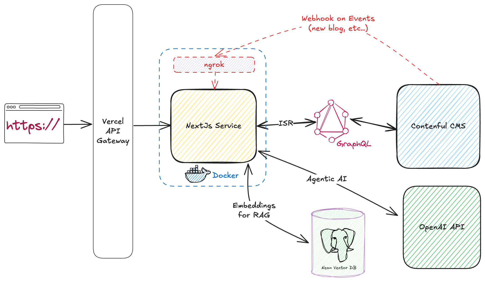

# AKQA Hub - Complete Technical Documentation

> **Ultimate Technical Reference** - A comprehensive guide to every architectural decision, implementation detail, and technical solution in the AKQA Hub application.

---

## Table of Contents

1. [Executive Summary](#executive-summary)
2. [System Architecture](#system-architecture)
3. [RAG System Implementation](#rag-system-implementation)
4. [Content Management](#content-management)
5. [Frontend Architecture](#frontend-architecture)
6. [AI Integration](#ai-integration)
7. [Database & Vector Store](#database--vector-store)
8. [API Layer](#api-layer)
9. [UI/UX Design System](#uiux-design-system)
10. [Internationalization](#internationalization)
11. [Performance Optimization](#performance-optimization)
12. [Security](#security)
13. [Deployment](#deployment)
14. [Development Workflow](#development-workflow)
15. [Testing Strategy](#testing-strategy)
16. [Troubleshooting Guide](#troubleshooting-guide)

---

## Executive Summary

### What is AKQA Hub?

AKQA Hub is a sophisticated, AI-powered content platform that combines:

- **Headless CMS** (Contentful) for content management
- **Vector Database** (Neon PostgreSQL with pgvector) for semantic search
- **Large Language Model** (OpenAI GPT-5 Mini) for intelligent content assistance
- **Modern Web Framework** (Next.js 15) for optimal performance

### Key Innovations

1. **Retrieval-Augmented Generation (RAG)**
   - AI assistant that understands and recommends content
   - Semantic search across all blog posts
   - Context-aware responses based on current article

2. **Multilingual Support**
   - Full i18n with English and German
   - Locale-aware routing and content delivery
   - Separate vector embeddings per language

3. **Real-time Content Preview**
   - Live preview for content editors
   - Draft mode for unpublished content
   - Instant updates without redeployment

---

## System Architecture

### High-Level Architecture



### Technology Stack

#### Core Technologies

- **Next.js 15.5.4** - React framework with App Router
- **React 19.2.0** - UI library
- **TypeScript 5.9.3** - Type safety
- **pnpm 9.17.0** - Package manager

#### Content & Data

- **Contentful** - Headless CMS
- **GraphQL** - Content API
- **Drizzle ORM 0.44.6** - Type-safe database ORM
- **Neon PostgreSQL** - Serverless Postgres
- **pgvector** - Vector similarity search

#### AI & ML

- **AI SDK 5.0.68** (Vercel) - AI framework
- **OpenAI GPT-5 Mini** - Language model
- **text-embedding-3-small** - 1536-dim embeddings
- **LangChain** - Text splitting

#### Styling & UI

- **Tailwind CSS 4.1.14** - Utility-first CSS
- **Shadcn UI** - Component library
- **Radix UI** - Accessible primitives
- **Framer Motion 12.23.24** - Animations

#### Development Tools

- **ESLint 9.37.0** - Code linting
- **TypeScript ESLint 8.46.0** - TS linting
- **Husky** - Git hooks
- **lint-staged** - Pre-commit checks

---

## RAG System Implementation

### Overview

The RAG (Retrieval-Augmented Generation) system enables the AI assistant to access and reason about blog content through semantic search and vector embeddings.

### Architecture Components

```
┌─────────────────────────────────────────────────────────────────┐
│                      RAG SYSTEM ARCHITECTURE                    │
└─────────────────────────────────────────────────────────────────┘

1. CONTENT INGESTION PIPELINE
   ┌──────────────┐
   │ Contentful   │
   │ GraphQL API  │
   └──────┬───────┘
          │
          ▼
   ┌──────────────────────────┐
   │ fetchAllBlogPosts()      │
   │ - Query all posts        │
   │ - Extract metadata       │
   │ - Get full content       │
   └──────┬───────────────────┘
          │
          ▼
   ┌──────────────────────────┐
   │ RecursiveCharacterText   │
   │ TextSplitter             │
   │ - chunkSize: 150         │
   │ - chunkOverlap: 20       │
   └──────┬───────────────────┘
          │
          ▼
   ┌──────────────────────────┐
   │ OpenAI Embeddings        │
   │ text-embedding-3-small   │
   │ - 1536 dimensions        │
   └──────┬───────────────────┘
          │
          ▼
   ┌──────────────────────────┐
   │ Neon PostgreSQL          │
   │ blog_embeddings table    │
   │ - Vector column          │
   │ - HNSW index             │
   └──────────────────────────┘

2. QUERY PIPELINE
   ┌──────────────┐
   │ User Query   │
   │ "Related     │
   │  articles?"  │
   └──────┬───────┘
          │
          ▼
   ┌──────────────────────────┐
   │ generateEmbedding()      │
   │ - Embed query text       │
   │ - Returns 1536-dim vector│
   └──────┬───────────────────┘
          │
          ▼
   ┌──────────────────────────┐
   │ semanticSearch()         │
   │ - Cosine distance calc   │
   │ - Threshold filtering     │
   │ - Locale filtering        │
   └──────┬───────────────────┘
          │
          ▼
   ┌──────────────────────────┐
   │ groupChunksByArticle()   │
   │ - Aggregate scores       │
   │ - Rank by similarity     │
   └──────┬───────────────────┘
          │
          ▼
   ┌──────────────────────────┐
   │ AI Tools Response        │
   │ - Formatted results      │
   │ - With locale/slug       │
   └──────────────────────────┘
```

### Database Schema

#### blog_embeddings Table

```sql
CREATE TABLE "blog_embeddings" (
  -- Primary Key
  "id" varchar(191) PRIMARY KEY NOT NULL,

  -- Contentful References
  "contentful_id" varchar(255) NOT NULL,
  "slug" varchar(255) NOT NULL,
  "locale" varchar(10) DEFAULT 'en-US' NOT NULL,

  -- Content Metadata
  "title" text NOT NULL,
  "short_description" text,
  "author_name" varchar(255),
  "published_date" timestamp,

  -- Chunk Information
  "chunk_content" text NOT NULL,
  "chunk_index" integer NOT NULL,
  "total_chunks" integer NOT NULL,

  -- Vector Embedding (1536 dimensions)
  "embedding" vector(1536) NOT NULL,

  -- Additional Metadata
  "tags" text[],

  -- Timestamps
  "last_synced_at" timestamp DEFAULT now() NOT NULL,
  "created_at" timestamp DEFAULT now() NOT NULL,
  "updated_at" timestamp DEFAULT now() NOT NULL
);

-- HNSW Index for Fast Vector Search
CREATE INDEX "embedding_idx" ON "blog_embeddings"
  USING hnsw ("embedding" vector_cosine_ops);

-- B-tree Indexes for Filtering
CREATE INDEX "slug_idx" ON "blog_embeddings" USING btree ("slug");
CREATE INDEX "contentful_id_idx" ON "blog_embeddings" USING btree ("contentful_id");
CREATE INDEX "locale_idx" ON "blog_embeddings" USING btree ("locale");
CREATE INDEX "chunk_idx" ON "blog_embeddings" USING btree ("contentful_id", "chunk_index");
```

### Vector Search Implementation

#### Key Files

1. **`src/db/schema/blog-embeddings.ts`** - Drizzle schema definition
2. **`src/lib/services/vector-db.ts`** - Vector operations
3. **`src/lib/services/embeddings.ts`** - OpenAI embedding generation
4. **`src/lib/services/contentful.ts`** - Content fetching
5. **`src/db/sync-blog-embeddings.ts`** - Sync script

#### Semantic Search Algorithm

```typescript
// src/lib/services/vector-db.ts

export async function semanticSearch(
  queryEmbedding: number[],
  options: {
    limit?: number;
    threshold?: number;
    locale?: string;
    excludeSlugs?: string[];
  } = {},
): Promise<SearchResult[]> {
  const { limit = 3, threshold = 0.5, locale, excludeSlugs = [] } = options;

  // Calculate similarity: 1 - cosine_distance
  // CRITICAL: Parentheses ensure correct operator precedence
  const similarity = sql<number>`1 - (${cosineDistance(blogEmbeddings.embedding, queryEmbedding)})`;

  // Build WHERE conditions
  const conditions = [gt(similarity, threshold)];

  if (locale) {
    conditions.push(eq(blogEmbeddings.locale, locale));
  }

  if (excludeSlugs.length > 0) {
    conditions.push(
      sql`${blogEmbeddings.slug} NOT IN (${sql.join(
        excludeSlugs.map(s => sql`${s}`),
        sql`, `,
      )})`,
    );
  }

  // Execute query with Drizzle ORM
  const results = await db
    .select({
      // ... all fields
      similarity,
    })
    .from(blogEmbeddings)
    .where(and(...conditions))
    .orderBy(desc(similarity))
    .limit(limit);

  return results as SearchResult[];
}
```

#### Critical Implementation Detail: PostgreSQL Operator Precedence

**Problem**: PostgreSQL interprets `1 - embedding <=> vector` as `(1 - embedding) <=> vector`, causing type errors.

**Solution**: Wrap cosineDistance in parentheses: `1 - (embedding <=> vector)`

```typescript
// ❌ WRONG - Precedence issue
sql<number>`1 - ${cosineDistance(...)}`

// ✅ CORRECT - Proper parentheses
sql<number>`1 - (${cosineDistance(...)})`
```

### Content Chunking Strategy

```typescript
// src/lib/services/embeddings.ts

import { RecursiveCharacterTextSplitter } from 'langchain/text_splitter';

const textSplitter = new RecursiveCharacterTextSplitter({
  chunkSize: 150, // Characters per chunk
  chunkOverlap: 20, // Overlap between chunks
  separators: ['\n\n', '\n', '. ', ' ', ''],
});

const chunks = await textSplitter.splitText(fullContent);
```

**Why These Values?**

- **150 chars**: Balances semantic coherence with granularity
- **20 overlap**: Preserves context at chunk boundaries
- **Separators**: Prioritize natural breaks (paragraphs → sentences → words)

### Sync Process

```typescript
// src/db/sync-blog-embeddings.ts

async function syncBlogEmbeddings(locale: string, singleSlug?: string) {
  // 1. Fetch posts from Contentful
  const posts = await fetchAllBlogPosts(locale, singleSlug);

  // 2. For each post...
  for (const post of posts) {
    // 3. Extract content
    const fullContent = extractPlainText(post.content);

    // 4. Split into chunks
    const chunks = await textSplitter.splitText(fullContent);

    // 5. Generate embeddings
    const embeddings = await embedMany({
      model: openai.embedding('text-embedding-3-small'),
      values: chunks,
    });

    // 6. Prepare database records
    const embeddingRecords = embeddings.map((embedding, idx) => ({
      contentfulId: post.sys.id,
      slug: post.slug,
      locale: post.locale,
      title: post.title,
      // ... metadata
      chunkContent: chunks[idx],
      chunkIndex: idx,
      totalChunks: chunks.length,
      embedding: embedding,
    }));

    // 7. Upsert to database (locale-aware)
    await upsertBlogEmbeddings(post.sys.id, locale, embeddingRecords);
  }
}
```

---

## AI Integration

### Chat API Architecture

```typescript
// src/app/api/chat/route.ts

export async function POST(req: Request) {
  const { messages }: { messages: UIMessage[] } = await req.json();

  // Extract context metadata
  const lastUserMessage = [...messages].reverse().find(m => m.role === 'user');
  const metadata = lastUserMessage?.metadata as Record<string, any> | undefined;
  const currentSlug = metadata?.currentSlug;
  const locale = metadata?.locale;

  // Enhance system prompt with context
  let enhancedSystemPrompt = SYSTEM_PROMPT;
  if (currentSlug && locale) {
    enhancedSystemPrompt += `\n\n**CURRENT PAGE CONTEXT**: The user is viewing "${currentSlug}" in "${locale}".`;
  }

  // Stream response with tools
  const result = streamText({
    model: openai('gpt-4o'),
    messages: convertToModelMessages(messages),
    tools: contentTools,
    system: enhancedSystemPrompt,
    stopWhen: stepCountIs(10),
    experimental_transform: smoothStream({
      delayInMs: 15,
      chunking: 'word',
    }),
  });

  return result.toUIMessageStreamResponse({
    sendReasoning: true,
    sendSources: true,
  });
}
```

### AI Tools (AI SDK v5)

```typescript
// src/lib/tools/content-tools.ts

const searchKnowledgeBase = tool({
  description: 'Search the content knowledge base for articles',
  inputSchema: z.object({
    query: z.string().describe('Search query'),
    limit: z.number().optional().default(5),
    locale: z.string().optional().default('en-US'),
  }),
  execute: async ({ query, limit, locale }) => {
    // 1. Generate embedding for query
    const queryEmbedding = await generateEmbedding(query);

    // 2. Semantic search
    const chunkResults = await semanticSearch(queryEmbedding, {
      limit: limit * 3,
      threshold: 0.5,
      locale,
    });

    // 3. Group by article
    const articleResults = groupChunksByArticle(chunkResults);

    // 4. Return top N articles (without similarity scores)
    return {
      success: true,
      results: articleResults.slice(0, limit).map(article => ({
        title: article.title,
        slug: article.slug,
        locale: article.locale,
        description: article.shortDescription,
        author: article.authorName,
        relevantExcerpt: article.matchingChunks[0]?.content,
      })),
    };
  },
});

const getArticleContent = tool({
  description: 'Retrieve full content of a specific article',
  inputSchema: z.object({
    slug: z.string().describe('Article slug'),
    locale: z.string().optional().default('en-US'),
  }),
  execute: async ({ slug, locale }) => {
    const chunks = await getBlogEmbeddingsBySlug(slug, locale);

    if (chunks.length === 0) {
      return { success: false, message: `Article not found: ${slug}` };
    }

    // Reconstruct full content from chunks
    const fullContent = chunks
      .sort((a, b) => a.chunkIndex - b.chunkIndex)
      .map(chunk => chunk.chunkContent)
      .join('\n\n');

    return {
      success: true,
      article: {
        title: chunks[0].title,
        slug: chunks[0].slug,
        locale: chunks[0].locale,
        content: fullContent,
        // ... metadata
      },
    };
  },
});

const recommendRelatedArticles = tool({
  description: 'Find articles similar to a given article',
  inputSchema: z.object({
    slug: z.string().describe('Reference article slug'),
    limit: z.number().optional().default(3),
    locale: z.string().optional().default('en-US'),
  }),
  execute: async ({ slug, limit, locale }) => {
    // Get reference article embeddings
    const referenceChunks = await getBlogEmbeddingsBySlug(slug, locale);

    if (referenceChunks.length === 0) {
      return {
        success: false,
        message: `Reference article not found: ${slug}`,
      };
    }

    // Use first chunk's embedding as representative
    const referenceEmbedding = referenceChunks[0].embedding as unknown as number[];

    // Search for similar articles (exclude reference)
    const chunkResults = await semanticSearch(referenceEmbedding, {
      limit: (limit + 1) * 3,
      threshold: 0.5,
      locale,
      excludeSlugs: [slug], // Crucial: exclude self
    });

    // Group and filter
    const articleResults = groupChunksByArticle(chunkResults);
    const recommendations = articleResults
      .filter(r => r.slug !== slug) // Double-check exclusion
      .slice(0, limit);

    return {
      success: recommendations.length > 0,
      message:
        recommendations.length === 0
          ? 'No related articles found'
          : `Found ${recommendations.length} related article(s)`,
      recommendations: recommendations.map(article => ({
        title: article.title,
        slug: article.slug,
        locale: article.locale,
        description: article.shortDescription,
        author: article.authorName,
      })),
    };
  },
});

export const contentTools = {
  searchKnowledgeBase,
  getArticleContent,
  recommendRelatedArticles,
};
```

### System Prompt Design

```typescript
const SYSTEM_PROMPT = `# Role and Objective
You are Lumen, the intelligent content assistant for a curated lifestyle brand's content hub.

# Available Tools
1. **searchKnowledgeBase** - Semantic search across all articles
2. **getArticleContent** - Retrieve full article by slug
3. **recommendRelatedArticles** - Find similar articles (auto-excludes reference)

# Context Awareness
When users reference "this article", check metadata.currentSlug and metadata.locale.

# Voice & Tone
- Refined yet accessible
- Human, not robotic (NO similarity scores or technical metrics)
- Thoughtful and concise

# Response Guidelines
- Always use tools before answering
- Cite with links: [Title](/locale/slug)
- Handle empty results gracefully
- Invite discovery with 1-2 related suggestions

# Link Format
- Tool returns {slug, locale} → [Title](/locale/slug)
- Example: [The Art of Slow Living](/en-US/slow-living)
`;
```

### Chat Widget Implementation

```typescript
// src/components/custom/chat-widget.tsx

export function ChatWidget() {
  const pathname = usePathname();
  const params = useParams();

  // Extract context from URL
  const currentSlug = typeof params?.slug === 'string' ? params.slug : undefined;
  const locale = typeof params?.locale === 'string' ? params.locale : 'en-US';

  const { messages, input, append, isLoading } = useChat({
    api: '/api/chat',
    maxSteps: 10,
  });

  const handleSubmit = async (e: FormEvent) => {
    e.preventDefault();
    if (!input.trim()) return;

    // Send message with metadata (not visible text)
    await append({
      role: 'user',
      content: input,
      metadata: {
        currentSlug,
        locale,
      },
    });
  };

  return (
    <Dialog>
      <DialogTrigger asChild>
        <Button variant="outline" size="icon">
          <MessageSquareIcon className="h-5 w-5" />
        </Button>
      </DialogTrigger>

      <DialogContent>
        <ScrollArea className="h-[60vh]">
          {messages.map(message => (
            <div key={message.id}>
              {message.role === 'user' ? (
                <UserMessage>{message.content}</UserMessage>
              ) : (
                <AssistantMessage>
                  {message.parts.map((part, i) => {
                    if (part.type === 'text') {
                      return <Response key={i}>{part.text}</Response>;
                    }
                    if (part.type === 'reasoning') {
                      return (
                        <Reasoning key={i}>
                          <ReasoningTrigger />
                          <ReasoningContent>{part.text}</ReasoningContent>
                        </Reasoning>
                      );
                    }
                    if (part.type === 'tool-call') {
                      return <ToolCall key={i} tool={part} />;
                    }
                  })}
                </AssistantMessage>
              )}
            </div>
          ))}
        </ScrollArea>

        <form onSubmit={handleSubmit}>
          <Input
            value={input}
            onChange={e => setInput(e.target.value)}
            placeholder="Ask about articles..."
          />
        </form>
      </DialogContent>
    </Dialog>
  );
}
```

### Markdown Rendering with Link Security

```typescript
// src/components/ai-elements/response.tsx

export const Response = memo(({ className, ...props }: ResponseProps) => (
  <Streamdown
    className={cn(
      'size-full',
      // Link styling - clearly visible and interactive
      '[&_a]:text-primary [&_a]:underline [&_a]:underline-offset-4',
      '[&_a]:decoration-primary/50 [&_a]:transition-colors',
      '[&_a:hover]:text-primary/80 [&_a:hover]:decoration-primary',
      '[&_a]:font-medium [&_a]:cursor-pointer',
      className,
    )}
    rehypePlugins={[
      defaultRehypePlugins.raw,
      defaultRehypePlugins.katex,
      [
        harden, // Security: sanitize links
        {
          defaultOrigin: typeof window !== 'undefined' ? window.location.origin : '',
          allowedLinkPrefixes: ['mailto:', '*'],
          sameTab: true, // Don't open in new tab
        },
      ],
    ]}
    {...props}
  />
));
```

---

## Content Management

### Contentful Setup

#### Content Model

```typescript
// Content Types in Contentful

1. Blog Post (pageBlogPost)
   - Title (Short text)
   - Slug (Short text, unique)
   - Author (Reference to Person)
   - Published Date (Date & time)
   - Featured Image (Media - Asset)
   - Short Description (Long text)
   - Content (Rich text)
   - Tags (Short text, list)
   - SEO Fields (SEO content type)

2. Person (componentAuthor)
   - Name (Short text)
   - Avatar (Media - Asset)
   - Bio (Long text)
   - Social Links (JSON)

3. SEO (componentSeo)
   - Title (Short text)
   - Description (Long text)
   - Keywords (Short text, list)
   - No Index (Boolean)
   - No Follow (Boolean)
```

#### GraphQL Queries

```graphql
# src/lib/graphql/pageBlogPost.graphql

query PageBlogPost($slug: String!, $locale: String!, $preview: Boolean) {
  pageBlogPostCollection(where: { slug: $slug }, locale: $locale, preview: $preview, limit: 1) {
    items {
      sys {
        id
        publishedAt
      }
      slug
      title
      shortDescription
      publishedDate
      author {
        ...AuthorFields
      }
      featuredImage {
        ...ImageFields
      }
      content {
        json
        links {
          assets {
            block {
              ...ImageFields
            }
          }
        }
      }
      seoFields {
        title
        description
        keywords
        noIndex
        noFollow
      }
    }
  }
}

fragment AuthorFields on ComponentAuthor {
  sys {
    id
  }
  name
  avatar {
    ...ImageFields
  }
}

fragment ImageFields on Asset {
  sys {
    id
  }
  title
  description
  url
  width
  height
  contentType
}
```

### GraphQL Code Generation

```typescript
// codegen.ts

import type { CodegenConfig } from '@graphql-codegen/cli';

const config: CodegenConfig = {
  overwrite: true,
  schema: [
    {
      [`https://graphql.contentful.com/content/v1/spaces/${process.env.CONTENTFUL_SPACE_ID}`]: {
        headers: {
          Authorization: `Bearer ${process.env.CONTENTFUL_ACCESS_TOKEN}`,
        },
      },
    },
  ],
  documents: 'src/lib/graphql/**/*.graphql',
  generates: {
    'src/lib/__generated/': {
      preset: 'client',
      presetConfig: {
        fragmentMasking: false,
      },
      config: {
        useTypeImports: true,
        skipTypename: true,
        enumsAsTypes: true,
        futureProofUnions: true,
        scalars: {
          DateTime: 'string',
          Dimension: 'number',
          Quality: 'number',
          HexColor: 'string',
        },
      },
    },
    'src/lib/__generated/sdk.ts': {
      plugins: ['typescript', 'typescript-operations', 'typescript-graphql-request'],
    },
  },
};

export default config;
```

### Contentful Client

```typescript
// src/lib/client.ts

import { GraphQLClient } from 'graphql-request';
import { getSdk } from '@src/lib/__generated/sdk';

const endpoint = `https://graphql.contentful.com/content/v1/spaces/${process.env.CONTENTFUL_SPACE_ID}`;

export const contentfulClient = new GraphQLClient(endpoint, {
  headers: {
    Authorization: `Bearer ${process.env.CONTENTFUL_ACCESS_TOKEN}`,
  },
});

export const previewClient = new GraphQLClient(endpoint, {
  headers: {
    Authorization: `Bearer ${process.env.CONTENTFUL_PREVIEW_ACCESS_TOKEN}`,
  },
});

export const sdk = getSdk(contentfulClient);
export const previewSdk = getSdk(previewClient);
```

---

## Frontend Architecture

### Next.js 15 App Router

```
src/app/
├── layout.tsx              # Root layout (HTML, body, providers)
├── globals.css             # Global styles, Tailwind imports
├── [locale]/               # Locale-based routing
│   ├── layout.tsx          # Locale layout (header, footer, i18n)
│   ├── page.tsx            # Homepage (blog list)
│   ├── not-found.tsx       # Locale-specific 404
│   ├── [slug]/             # Dynamic blog post routes
│   │   └── page.tsx        # Blog post page
│   ├── [...notFound]/      # Catch-all 404
│   │   └── page.tsx
│   └── admin/              # Admin pages
│       ├── sync/
│       │   └── page.tsx    # Sync blog embeddings
│       └── status/
│           └── page.tsx    # Check sync status
└── api/
    ├── chat/
    │   └── route.ts        # AI chat endpoint
    └── enable-draft/
        └── route.ts        # Draft mode enabler
```

### Component Architecture

```
src/components/
├── ai-elements/            # AI-specific components
│   ├── response.tsx        # Markdown renderer with link security
│   ├── reasoning.tsx       # AI reasoning display
│   ├── chain-of-thought.tsx # Step-by-step thinking
│   ├── message.tsx         # Chat message wrapper
│   └── ...
│
├── custom/                 # Custom app components
│   ├── chat-widget.tsx     # Floating chat button & dialog
│   ├── chat.tsx            # Full chat interface
│   ├── theme-provider.tsx  # Dark/light mode
│   └── ...
│
├── features/               # Feature-specific components
│   ├── article/
│   │   ├── ArticleHero.tsx     # Blog post hero section
│   │   ├── ArticleContent.tsx  # Rich text renderer
│   │   ├── ArticleTile.tsx     # Blog card
│   │   └── ArticleTileGrid.tsx # Blog grid
│   │
│   ├── contentful/
│   │   ├── CtfImage.tsx        # Optimized image component
│   │   ├── CtfRichText.tsx     # Rich text renderer
│   │   └── CtfPreviewProvider.tsx # Live preview wrapper
│   │
│   └── language-selector/
│       └── LanguageSelector.tsx # Locale switcher
│
├── shared/                 # Shared utilities
│   ├── container/          # Layout container
│   ├── format-date/        # Date formatter
│   └── i18n/               # Translation provider
│
├── templates/              # Page templates
│   ├── header/             # Site header
│   └── footer/             # Site footer
│
└── ui/                     # Shadcn UI components
    ├── button.tsx
    ├── dialog.tsx
    ├── dropdown-menu.tsx
    └── ...
```

### Routing & Middleware

```typescript
// src/middleware.ts

import { i18nRouter } from 'next-i18n-router';
import { NextRequest } from 'next/server';
import { i18nConfig } from './i18n/config';

export function middleware(request: NextRequest) {
  return i18nRouter(request, i18nConfig);
}

export const config = {
  matcher: '/((?!api|_next/static|_next/image|assets|favicon.ico).*)',
};
```

```typescript
// src/i18n/config.ts

export const i18nConfig = {
  locales: ['en-US', 'de-DE'],
  defaultLocale: 'en-US',
  routingStrategy: 'dynamicSegment',
};
```

---

## UI/UX Design System

### Typography System

The application uses a sophisticated typography hierarchy:

1. **FK Display** (`--font-display`) - Hero sections, major headlines
2. **PP Editorial New** (`--font-heading`) - Titles, headings, section headers
3. **FK Grotesk** (`--font-body`) - UI elements, navigation, short text
4. **Goudy Old Style** (`--font-serif`) - Long-form articles, blog posts
5. **JetBrains Mono** (`--font-mono`) - Code blocks, technical content

#### Usage

```tsx
// Utility classes
<h1 className="font-display text-6xl">Hero Headline</h1>
<h2 className="font-heading text-4xl">Article Title</h2>
<p className="font-body text-base">UI text</p>
<article className="font-serif text-lg">Blog content...</article>
<code className="font-mono text-sm">const x = 1;</code>

// Pre-built component classes
<h1 className="blog-title">Post Title</h1>
<div className="blog-content">
  <p>Auto-styled content...</p>
</div>
```

### Color System

```css
/* Tailwind CSS Variables */
:root {
  --background: 0 0% 100%;
  --foreground: 240 10% 3.9%;
  --card: 0 0% 100%;
  --card-foreground: 240 10% 3.9%;
  --popover: 0 0% 100%;
  --popover-foreground: 240 10% 3.9%;
  --primary: 240 5.9% 10%;
  --primary-foreground: 0 0% 98%;
  --secondary: 240 4.8% 95.9%;
  --secondary-foreground: 240 5.9% 10%;
  --muted: 240 4.8% 95.9%;
  --muted-foreground: 240 3.8% 46.1%;
  --accent: 240 4.8% 95.9%;
  --accent-foreground: 240 5.9% 10%;
  --destructive: 0 84.2% 60.2%;
  --destructive-foreground: 0 0% 98%;
  --border: 240 5.9% 90%;
  --input: 240 5.9% 90%;
  --ring: 240 5.9% 10%;
  --radius: 0.5rem;
}

.dark {
  --background: 240 10% 3.9%;
  --foreground: 0 0% 98%;
  /* ... dark mode variants */
}
```

### Component Library

Built with **Shadcn UI** and **Radix UI** for:

- Accessibility (ARIA attributes, keyboard navigation)
- Composability (compound components)
- Customization (Tailwind CSS classes)

Key components:

- Button, Dialog, DropdownMenu, ScrollArea
- Card, Badge, Input, Textarea
- Collapsible, Accordion, Tabs
- Toast, Tooltip, Avatar

---

## Internationalization

### Locale Configuration

```typescript
// public/locales/en-US/common.json
{
  "nav": {
    "home": "Home",
    "about": "About",
    "contact": "Contact"
  },
  "footer": {
    "copyright": "© 2025 AKQA Hub"
  }
}

// public/locales/de-DE/common.json
{
  "nav": {
    "home": "Startseite",
    "about": "Über uns",
    "contact": "Kontakt"
  },
  "footer": {
    "copyright": "© 2025 AKQA Hub"
  }
}
```

### Translation Hook

```typescript
// Usage in components
import { useTranslation } from '@src/components/shared/i18n/TranslationsProvider';

export function Header() {
  const { t } = useTranslation();

  return (
    <nav>
      <Link href="/">{t('nav.home')}</Link>
      <Link href="/about">{t('nav.about')}</Link>
    </nav>
  );
}
```

### Locale-Aware Routing

```typescript
// Links automatically include locale
import Link from 'next/link';

<Link href="/my-post">
  My Post
</Link>

// Rendered as: /en-US/my-post or /de-DE/my-post
```

### Vector Embeddings per Locale

Each locale has separate embeddings:

```sql
SELECT slug, locale, title
FROM blog_embeddings
WHERE locale = 'de-DE';
```

This ensures:

- Language-specific semantic search
- No mixing of English and German results
- Accurate similarity matching per language

---

## Performance Optimization

### Next.js Optimizations

1. **Incremental Static Regeneration (ISR)**

```typescript
// src/app/[locale]/[slug]/page.tsx

export const revalidate = 3600; // Revalidate every hour
```

2. **Image Optimization**

```typescript
<Image
  src={imageUrl}
  alt={alt}
  width={width}
  height={height}
  loading="lazy"
  placeholder="blur"
  blurDataURL={blurDataURL}
/>
```

3. **Font Optimization**

```typescript
import localFont from 'next/font/local';

const fkDisplay = localFont({
  src: './FK Display/FKDisplay-Regular.otf',
  variable: '--font-display',
  display: 'swap',
  preload: true,
});
```

### Database Optimization

1. **HNSW Index for Vector Search**

```sql
CREATE INDEX embedding_idx ON blog_embeddings
  USING hnsw (embedding vector_cosine_ops);
```

Benefits:

- O(log N) search complexity
- 10-100x faster than sequential scan
- Tunable trade-off between speed and accuracy

2. **B-tree Indexes for Filters**

```sql
CREATE INDEX slug_idx ON blog_embeddings (slug);
CREATE INDEX locale_idx ON blog_embeddings (locale);
```

3. **Query Optimization**

```typescript
// Fetch 3x chunks to ensure enough unique articles
const chunkResults = await semanticSearch(queryEmbedding, {
  limit: requestedLimit * 3,
  threshold: 0.5,
  locale,
});

// Then group and take top N
const articles = groupChunksByArticle(chunkResults).slice(0, requestedLimit);
```

### Caching Strategy

1. **Static Generation** - Blog posts pre-rendered at build time
2. **ISR** - Re-generate on-demand with revalidation
3. **CDN Caching** - Vercel Edge Network caches static assets
4. **Client-Side Caching** - React Query for API data

---

## Security

### Content Security

1. **Link Sanitization** (rehype-harden)

```typescript
[
  harden,
  {
    defaultOrigin: window.location.origin,
    allowedLinkPrefixes: ['mailto:', '*'],
    sameTab: true,
  },
];
```

2. **Rich Text Sanitization**

- Contentful Rich Text is pre-sanitized
- Rendered with `documentToReactComponents`
- No dangerouslySetInnerHTML

### API Security

1. **Environment Variables**

```env
CONTENTFUL_SPACE_ID=xxx
CONTENTFUL_ACCESS_TOKEN=xxx
OPENAI_API_KEY=xxx
DATABASE_URL=xxx
```

2. **Rate Limiting** (via Vercel)

- Per-IP rate limiting
- Function execution timeout: 30s

3. **CORS Headers**

```javascript
// config/headers.js
module.exports = [
  {
    source: '/api/:path*',
    headers: [
      { key: 'Access-Control-Allow-Origin', value: process.env.NEXT_PUBLIC_URL },
      { key: 'Access-Control-Allow-Methods', value: 'POST' },
    ],
  },
];
```

### Database Security

1. **Connection Pooling** (Neon)
2. **Prepared Statements** (Drizzle ORM)
3. **No Direct SQL Injection** - All queries use parameterized statements

---

## Deployment

### Environment Setup

1. **Contentful**
   - Create space
   - Set up content model
   - Generate API keys

2. **Neon PostgreSQL**
   - Create project
   - Enable pgvector extension
   - Copy connection string

3. **OpenAI**
   - Create API key
   - Enable embeddings & chat models

4. **Vercel**
   - Connect GitHub repo
   - Add environment variables
   - Deploy

### Database Migration

```bash
# Generate migration
pnpm db:generate

# Apply migration
pnpm db:migrate

# Sync embeddings
pnpm db:sync-embeddings
```

---

## Development Workflow

### Setup

```bash
# Clone repo
git clone https://github.com/diabahmed/akqa-hub.git
cd akqa-hub

# Install dependencies
pnpm install

# Set up environment
cp .env.example .env
# Fill in .env with your keys

# Run database migrations
pnpm db:migrate

# Generate GraphQL types
pnpm codegen

# Start dev server
pnpm dev
```

### Scripts

```json
{
  "prepare": "husky",
  "dev": "next dev --turbopack",
  "build": "eslint . --fix && next build",
  "start": "next start",
  "lint": "eslint .",
  "lint:fix": "eslint . --fix",
  "type-check": "tsc --noEmit",
  "graphql-codegen:generate": "graphql-codegen -r dotenv/config --config codegen.ts",
  "graphql-codegen:watch": "graphql-codegen --watch -r dotenv/config --config codegen.ts",
  "setup": "./bin/setup.sh",
  "docker:up": "docker-compose up -d --build",
  "docker:down": "docker-compose down -v",
  "db:setup": "tsx src/db/setup-vector.ts",
  "db:sync-content": "tsx src/db/sync-content.ts",
  "db:generate": "drizzle-kit generate",
  "db:migrate": "tsx lib/db/migrate.ts",
  "db:push": "drizzle-kit push",
  "db:pull": "drizzle-kit pull",
  "db:drop": "drizzle-kit drop",
  "db:studio": "drizzle-kit studio",
  "db:check": "drizzle-kit check"
}
```

### Git Workflow

1. **Husky Pre-commit**
   - ESLint checks
   - TypeScript checks
   - Prettier formatting

2. **Branch Strategy**
   - `main` - Production
   - `develop` - Development
   - `feature/*` - Feature branches

### Code Quality

1. **TypeScript** - Strict mode enabled
2. **ESLint** - Next.js + TypeScript config
3. **Prettier** - Consistent formatting
4. **lint-staged** - Pre-commit checks

---

## Testing Strategy

### Manual Testing

1. **Admin UI Testing**
   - `/[locale]/admin/sync` - Test sync functionality
   - `/[locale]/admin/status` - Check embedding counts

2. **Chat Widget Testing**
   - Test search: "What articles discuss X?"
   - Test summarization: "Summarize this article"
   - Test recommendations: "What are related articles?"

3. **Link Testing**
   - Click links in chat responses
   - Verify navigation works
   - Check locale preservation

### Test Queries

```typescript
// Test suggestions in chat widget
const suggestions = [
  'What are the main topics covered in this article?',
  'Can you find related articles about this topic?',
  'Summarize this article in 3 key points',
  'What other articles might I find interesting?',
];
```

---

## Troubleshooting Guide

### Common Issues

#### 1. PostgreSQL Operator Error

**Error**: `operator does not exist: integer - vector`

**Cause**: Incorrect operator precedence in cosine distance calculation

**Solution**: Ensure parentheses around cosineDistance:

```typescript
// ✅ CORRECT
sql<number>`1 - (${cosineDistance(...)})`

// ❌ WRONG
sql<number>`1 - ${cosineDistance(...)}`
```

#### 2. Links Not Clickable

**Cause**: Missing or incorrect rehype-harden configuration

**Solution**: Add to Response component:

```typescript
rehypePlugins={[
  [harden, {
    defaultOrigin: window.location.origin,
    allowedLinkPrefixes: ['mailto:', '*'],
    sameTab: true,
  }],
]}
```

#### 3. Same Article Recommended

**Cause**: Reference article not excluded from search

**Solution**: Already implemented with `excludeSlugs`:

```typescript
await semanticSearch(referenceEmbedding, {
  excludeSlugs: [slug], // Exclude reference article
});
```

#### 4. No Embeddings Found

**Cause**: Sync not run or failed

**Solution**: Run sync script:

```bash
pnpm db:sync-embeddings
```

Check logs for errors.

#### 5. GraphQL Type Errors

**Cause**: Generated types out of sync with Contentful schema

**Solution**: Regenerate types:

```bash
pnpm codegen
```

---

## Technical Decisions & Rationale

### Why Next.js 15?

- **App Router**: Modern routing with server components
- **Server-Side Rendering**: SEO-friendly blog posts
- **ISR**: Balance between static and dynamic content
- **Edge Runtime**: Fast global performance

### Why Contentful?

- **Headless CMS**: Decoupled content management
- **GraphQL API**: Type-safe, efficient queries
- **Live Preview**: Real-time content editing
- **Multi-language**: Built-in localization

### Why pgvector?

- **Native PostgreSQL**: No separate vector database
- **HNSW Index**: Fast approximate nearest neighbor search
- **Scalability**: Handles millions of vectors
- **Cost-Effective**: Neon serverless pricing

### Why AI SDK (Vercel)?

- **Tool Calling**: Native support for AI tools (v5)
- **Streaming**: Real-time response streaming
- **Reasoning**: Built-in reasoning display
- **Type-Safe**: Full TypeScript support

### Why Drizzle ORM?

- **Type Safety**: Full TypeScript inference
- **SQL-like**: Familiar syntax for SQL developers
- **Migration**: Built-in migration system
- **Performance**: No query overhead

### Why LangChain Text Splitter?

- **Smart Chunking**: Respects semantic boundaries
- **Configurable**: Tunable chunk size and overlap
- **Production-Ready**: Battle-tested library

---

## Performance Metrics

### Target Metrics

- **Time to First Byte (TTFB)**: < 200ms
- **First Contentful Paint (FCP)**: < 1.8s
- **Largest Contentful Paint (LCP)**: < 2.5s
- **Cumulative Layout Shift (CLS)**: < 0.1
- **Time to Interactive (TTI)**: < 3.5s

### AI Response Times

- **Search Query**: 1-2 seconds
- **Get Content**: 500-1000ms
- **Recommendations**: 1-2 seconds
- **Streaming**: Real-time (15ms chunk delay)

### Database Performance

- **Vector Search**: 10-50ms (HNSW index)
- **Full-text Search**: 5-15ms (B-tree index)
- **Chunk Retrieval**: < 10ms

---

## Future Enhancements

### Planned Features

1. **Multi-modal RAG**
   - Image embeddings
   - Search by visual similarity

2. **Advanced Analytics**
   - User engagement metrics
   - Popular articles dashboard
   - Search analytics

3. **Enhanced AI Capabilities**
   - Multi-turn conversations
   - Follow-up questions
   - Conversation history

4. **Content Recommendations**
   - Personalized recommendations
   - Reading history tracking
   - Similar authors

5. **Performance Optimizations**
   - Redis caching layer
   - Pre-computed embeddings
   - Incremental sync

---

## Conclusion

AKQA Hub represents a state-of-the-art implementation of RAG (Retrieval-Augmented Generation) in a production web application. By combining:

- **Contentful** for flexible content management
- **Next.js 15** for optimal performance
- **PostgreSQL + pgvector** for efficient vector search
- **OpenAI GPT-4o** for intelligent assistance
- **AI SDK v5** for seamless AI integration

We've created a system that:

- ✅ Provides semantic search across all content
- ✅ Recommends related articles intelligently
- ✅ Answers questions about content accurately
- ✅ Maintains context awareness
- ✅ Supports multiple languages
- ✅ Delivers fast, reliable performance

This documentation serves as a complete technical reference for understanding, maintaining, and extending the AKQA Hub platform.

---

**Last Updated**: October 13, 2025  
**Version**: 1.0.0  
**Author**: Ahmed Diab
